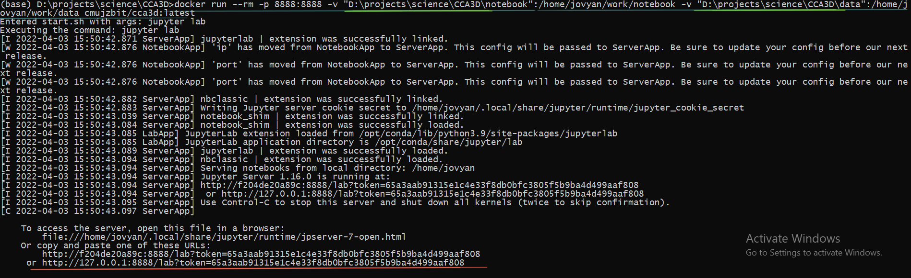
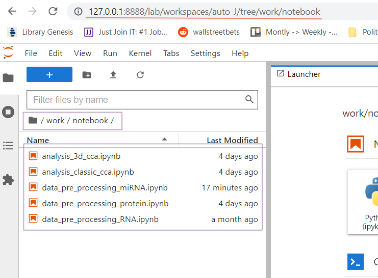

# CCA 3D 
Banch of notebooks to perform 3D CCA analysis. To perform it, you only need to attached your data when you start a notebook.


## User guide:

### Prerequisites:
#### Docker installation
Docker installation is necessary to run docker image with JupyterLab: https://docs.docker.com/engine/install/.  
Make sure that docker deamon is running, before go to How to use. TODO put screen.

### How to use:
### Run JupyterLab with Docker
Run this command in cmd, anaconda prompt or any other terminal. It will start a JupyterLab with notebooks. It is an integrated environment to perform the analysis.

```bash
docker run --rm -p 8888:8888 -v "D:\projects\science\CCA3D\notebook":/home/jovyan/work/notebook -v "D:\projects\science\CCA3D\data":/home/jovyan/work/data cmujzbit/cca3d:latest
```
Look at below screen shoot please:
  * Green color is the run command from above, and light green is an path where you have cloned our repository from Github.
  * Red color is the path which you have to copy from termina to browser (Chrome, Firefox or Opera).



After you copy the link from termina to browser's bar, then you can connect to JupyterLab, which includes all necessary data and scripts to perform experiment.



Structure of directories in work directory looks like that:
  * /work/data (all data to analysis are located here)
    * /work/data/raw_data (date before preprocessing),
    * /work/data/clean_data (date after preprocessing performed by data_pre_processing_* scripts),
  * /work/notbook (notebooks which perform the job)
    * /work/notbook/data_pre_processing_* (notebooks which perform pre-procesing of data),
    * /work/notbook/analysis_* (notebooks which perform analysis of data).

Which notebook is doing what?
  * work/notebook/data_pre_processing_miRNA.ipynb <- preprocessing of miRNA data,
  * work/notebook/data_pre_processing_protein.ipynb <- preprocessing of protein data,
  * work/notebook/data_pre_processing_RNA.ipynb <- preprocessing of RNA data,
  * work/notebook/analysis_3d_cca.ipynb <- notebook which presents new approach with CCA 3D analysis,
  * work/notebook/analysis_classic_cca.ipynb <- classic CCA 2D approach to compare.  

## Developer guide:


### Docker build commands
Commands to build jupyter server on Windows from Anaconda prompt. Build should be done from project root directory. In my case it is (base) D:\projects\science\CCA3D>.   

```bash
docker build .\docker\. -t cmujzbit/cca3d:latest
```

Make the new build public:
```bash
docker push cmujzbit/cca3d:latest
```
